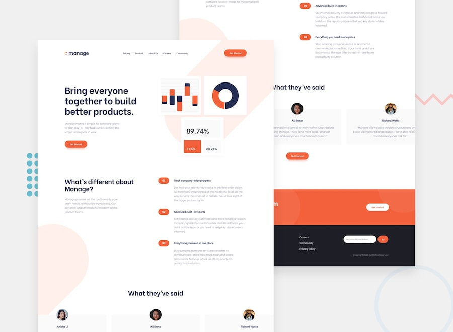

# Frontend Mentor - Manage landing page

This is a solution to the [Manage landing page challenge on Frontend Mentor](https://www.frontendmentor.io/challenges/manage-landing-page-SLXqC6P5). Frontend Mentor challenges help you improve your coding skills by building realistic projects.

### Links

- Solution URL: [github.com/tevashov/FrontEndMentor.io-Challenges/tree/master/manage-landing-page](https://github.com/tevashov/FrontEndMentor.io-Challenges/tree/manage-landing-page)
- Live Site URL: [tevashov.github.io/FrontEndMentor.io-Challenges/manage-landing-page](https://tevashov.github.io/FrontEndMentor.io-Challenges/manage-landing-page/)

## Author

- Website - [Teff](https://github.com/tevashov)
- Frontend Mentor - [@tevashov](https://www.frontendmentor.io/profile/tevashov)
- Twitter - [@teff_101](https://twitter.com/teff_101)